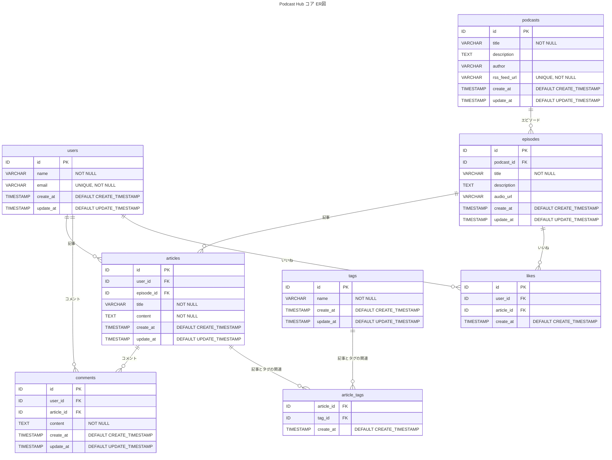

サービスの構造を理解しやすくするために、大枠の DB 設計を記載する

```mermaid
---
title: "Podcast Hub コア ER図"
---
erDiagram
    users ||--o{ articles : "記事"
    podcasts ||--o{ episodes : "エピソード"
    episodes ||--o{ articles : "記事"
    articles ||--o{ comments : "コメント"
    users ||--o{ comments : "コメント"
    episodes ||--o{ likes : "いいね"
    users ||--o{ likes : "いいね"
    articles ||--o{ article_tags : "記事とタグの関連"
    tags ||--o{ article_tags : "記事とタグの関連"

    users {
        ID id PK
        VARCHAR name "NOT NULL"
        VARCHAR email "UNIQUE, NOT NULL"
        TIMESTAMP create_at "DEFAULT CREATE_TIMESTAMP"
        TIMESTAMP update_at "DEFAULT UPDATE_TIMESTAMP"
    }

    articles {
        ID id PK
        ID user_id FK
        ID episode_id FK
        VARCHAR title "NOT NULL"
        TEXT content "NOT NULL"
        TIMESTAMP create_at "DEFAULT CREATE_TIMESTAMP"
        TIMESTAMP update_at "DEFAULT UPDATE_TIMESTAMP"
    }

    podcasts {
        ID id PK
        VARCHAR title "NOT NULL"
        TEXT description
        VARCHAR author
        VARCHAR rss_feed_url "UNIQUE, NOT NULL"
        TIMESTAMP create_at "DEFAULT CREATE_TIMESTAMP"
        TIMESTAMP update_at "DEFAULT UPDATE_TIMESTAMP"
    }

    episodes {
        ID id PK
        ID podcast_id FK
        VARCHAR title "NOT NULL"
        TEXT description
        VARCHAR audio_url
        TIMESTAMP create_at "DEFAULT CREATE_TIMESTAMP"
        TIMESTAMP update_at "DEFAULT UPDATE_TIMESTAMP"
    }

    comments {
        ID id PK
        ID user_id FK
        ID article_id FK
        TEXT content "NOT NULL"
        TIMESTAMP create_at "DEFAULT CREATE_TIMESTAMP"
        TIMESTAMP update_at "DEFAULT UPDATE_TIMESTAMP"
    }

    likes {
        ID id PK
        ID user_id FK
        ID article_id FK
        TIMESTAMP create_at "DEFAULT CREATE_TIMESTAMP"
    }

    tags {
        ID id PK
        VARCHAR name "NOT NULL"
        TIMESTAMP create_at "DEFAULT CREATE_TIMESTAMP"
        TIMESTAMP update_at "DEFAULT UPDATE_TIMESTAMP"
    }

    article_tags {
        ID article_id FK
        ID tag_id FK
        TIMESTAMP create_at "DEFAULT CREATE_TIMESTAMP"
    }
```
